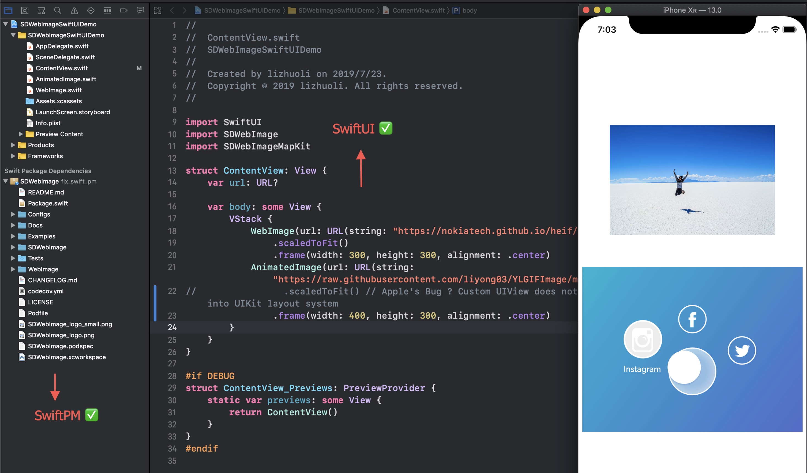

# SDWebImageSwiftUI

[](https://travis-ci.com/SDWebImage/SDWebImageSwiftUI)
[](https://cocoapods.org/pods/SDWebImageSwiftUI)
[](https://cocoapods.org/pods/SDWebImageSwiftUI)
[](https://cocoapods.org/pods/SDWebImageSwiftUI)
[](https://github.com/Carthage/Carthage)
[](https://swift.org/package-manager/)

## What's for

This is an experimental project for [SDWebImage](https://github.com/SDWebImage/SDWebImage).

It aims to ensure the following function available for users and try to do some experiment for Swift platform.

+ Swift Package Manager integration
+ SwiftUI compatibility
+ Swift source code compatibility

Note we do not gurantee the public API stable for current status. Since Xcode 11 is not get released and SwiftUI is a new platform for us.

## Requirements

+ Xcode 11+
+ iOS 13+
+ macOS 10.15+
+ tvOS 13+
+ watchOS 6+

## Installation

#### CocoaPods

SDWebImageSwiftUI is available through [CocoaPods](https://cocoapods.org). To install
it, simply add the following line to your Podfile:

```ruby
pod 'SDWebImageSwiftUI'
```

#### Carthage

SDWebImageSwiftUI is available through [Carthage](https://github.com/Carthage/Carthage).

```
github "SDWebImage/SDWebImageSwiftUI"
```

#### Swift Package Manager

SDWebImageSwiftUI is available through [Swift Package Manager](https://swift.org/package-manager/).

```swift
let package = Package(
    dependencies: [
        .package(url: "https://github.com/SDWebImage/SDWebImageSwiftUI.git", from: "0.1")
    ],
)
```

## Usage

+ Using `WebImage` to load network image

It supports the placeholder and detail options control for image loading as SDWebImage.

```swift
var body: some View {
    WebImage(url: URL(string: "https://nokiatech.github.io/heif/content/images/ski_jump_1440x960.heic")!)
        .scaledToFit()
        .frame(width: 300, height: 300, alignment: .center)
}
```

+ Using `AnimatedImage` to play animation

```swift
var body: some View {
    AnimatedImage(url: URL(string: "https://raw.githubusercontent.com/liyong03/YLGIFImage/master/YLGIFImageDemo/YLGIFImageDemo/joy.gif")!)
    AnimatedImage(data: try! Data(contentsOf: URL(fileURLWithPath: "/tmp/foo.webp")))
}
```

It supports both image url or image data for animated image format.

## Demo

To run the example using SwiftUI, following the steps:

```
cd Example
pod install
```

Then open the Xcode Workspace to run the demo application.

## Screenshot



## Author

DreamPiggy

## License

SDWebImageSwiftUI is available under the MIT license. See the LICENSE file for more info.


